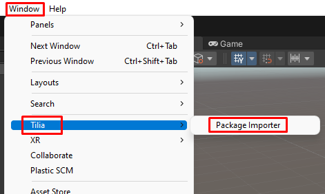
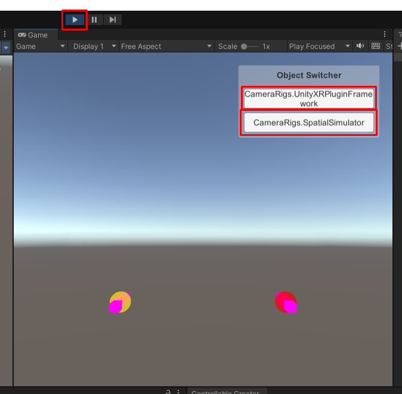

# VR Player Package (Установка)

> * Reading Time: 10 minutes
>
> * Checked with: Unity 2022.3.50f1

## Introduction

VR Player Package основан на тулките VRTK v4.

Данный гайд посвящен быстрой настройке проекта для запуска на VR-шлеме (Oculus Quest 1/2 или HTC Vive).

VRPP содержит уже настроенный префаб игрока с 3D-симуляцией, плавным передвижением и системой захватом предметов.

## Let's Start

### Шаг 1

Создайте новый проект в Unity. Используйте шаблон `3D Core`.

Для игрока нужен пол/платформа, который остановит игрока от падения вниз.
Поэтому создайте новый примитивный объект `Cube` выбрав `Main Menu -> GameObject -> 3D Object -> Cube` и измените параметры компонента `Transform`:

> * Position: `X = 0, Y = -0.5, Z = 0`
> * Scale: `X = 3, Y = 1, Z = 3`

Переименуйте `Cube`	`rgb(9, 105, 218)`на `Floor`.

Удалите `Main Camera` со сцены.

### Шаг 2

Скачайте и импортируйте в проект пакет `VR Player Package`. 

---> [VRPlayerPackage] <---

Переместите на сцену префаб `Player`

Обратите внимание на ошибки в консоли (красный текст внизу экрана). Они говорят об отсутствии некоторых вложенных префабов у игрока (частей игрока), которые необходимо скачать/установить на следущем шаге.

### Шаг 3

Скачайте и импортируйте из Asset Store пакет `VRTK v4 Tilia Package Importer`. 

---> [vrtk-v4-tilia-package-importer] <---

В диалоговом окне нажать `Install/Upgrade`.

### Шаг 4

Откройте `Windows -> Tilia -> Package Importer` и нажмите на кнопку `Add Scoped Registry`. 

Поставьте флажки напротив всех пакетов, кроме:

* `tilia.sdk.oculusintegration.unity`
* `tilia.sdk.picointegration.unity`
* `tilia.sdk.steamvr.unity`
* `tilia.sdk.wavexr.unity`

Нажмите на кнопку `Add Selected Packages`.

Дождитесь окончания загрузки всех пакетов.

Появляется окно с предложением перейти на новую систему Input, выберите `Yes`, после чего проект перезагрузится.

В окне `Manage Unity InputManager Axis Definition` нажмите на кнопку `Add Input Definitions`.

Закройте плавающие окна, если такие есть.

### Шаг 5

Открыть настройки проекта `Edit -> Project Settings`. Перейти на `XR Plugin Management`. Поставить флажок напротив `Open XR`.

 

После пройти `Edit -> Project Settings -> XR Plugin Management -> Project Validation` и нажать на `Fix All`. Дождитесь компиляции скриптов(два из трех желтых предупреждения исчезнут из списка).

создать новый профайл взаимодействия, выбрав в `Interaction Profiles` `Oculus Touch Controller Profile` и/или `HTC Vive Controller Profile`

## Готово

Нажмите на `Play`. В правом верхем углу окна `Game` появится интерфейс с кнопками `CameraRigs.SpatialSimulator` для запуска симуляции и `CameraRigs.UnityXRPluginFramework` для запуска на подключенном к ПК VR-шлеме. 
	
> Если перед этим вы установили и настроили приложение `Oculus` для шлема `Oculus Quest 2` или `Steam VR` для шлема `HTC Vive`, то все запустится без проблем.
	

	
[Installation]: https://github.com/ExtendRealityLtd/Tilia.Indicators.ObjectPointers.Unity/blob/master/Documentation/HowToGuides/Installation/README.md
[vrtk-v4-tilia-package-importer]: https://assetstore.unity.com/packages/tools/utilities/vrtk-v4-tilia-package-importer-214936
[VRPlayerPackage]: assets/VRPlayerPackagePrefab/

