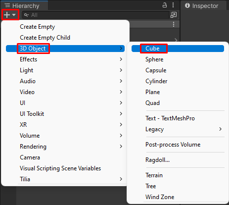
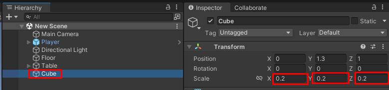
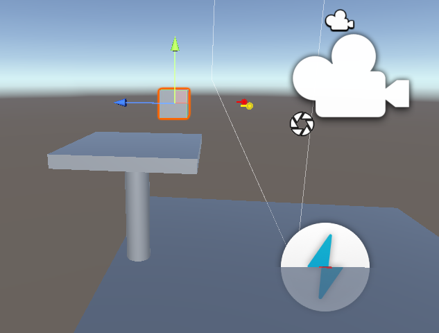

# Создание интерактивного объекта (Interactable)

> * Reading Time: 10 minutes
>
> * Checked with: Unity 2021.3.9f1

## Introduction

Данный гайд предназначен для создания интерактивного объекта (Interactable) на сцене. Данный объект возможно захватывать/отпускать (Grab/Ungrab), перемещать, кидать. 

## Let's Start

### Шаг 1

Создайте/добавьте объект на сцену, с которым хотите взаимодействовать, например `Cube`. Измените его размер через параметр `Scale` на `0.2`. Переместите его на возвышенное место (стол).

