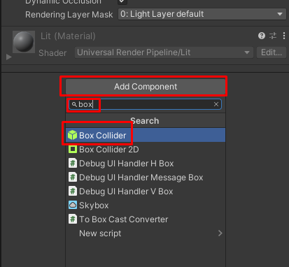
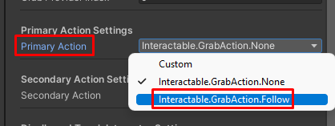
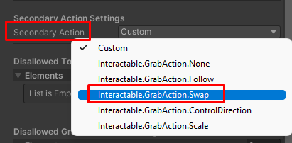
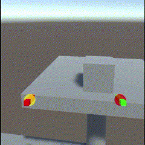

# Создание интерактивного объекта (Interactable)

> * Reading Time: 10 minutes
>
> * Checked with: Unity 2021.3.9f1

## Introduction

Данный гайд предназначен для создания интерактивного объекта (Interactable) на сцене. Данный объект возможно захватывать/отпускать (Grab/Ungrab), перемещать, кидать. 

## Let's Start

### Шаг 1

Создайте/добавьте объект на сцену, с которым хотите взаимодействовать, например `Cube`. Измените его размер через параметр `Scale` на `0.2`. Переместите его на возвышенное место (стол).

### Шаг 2

Убедитесь, что у объекта есть коллайдер (`Box`, `Sphere`, `Cylinder` или `Mesh Collider`). 
Если он отсутствует у объекта, то добавьте новый компонент `Box Collider`. Для этого нажмите на кнопку `Add Component` в самом внизу окна `Inspector`. В поисковом поле введите `Box Collider` и выберите его из выпадающего списка ниже.

	:red_circle: Mesh Collider :red_circle:

  
  Если у объекта имеется `Mesh Collider`, то убедитесь, что активен параметр `Convex` :ballot_box_with_check:.
  
  

	:red_circle: Если объект состоит из нескольких объектов :red_circle:

  Если у объекта имеются дочерние объекты, то нужно добавить на *каждый* объект с компонентом `Mesh Renderer` компонент `Mesh Collider`.
  
  
  

### Шаг 3

Откройте `Window -> Tilia -> Interactions -> Interactable Creator`. Данный инструмент автоматически преобразует объект в интерактивный, добавляя необходимые скрипты/объекты/компоненты.
Выберите объект `Cube` и нажмите на кнопку `Convert To Interactable`

  
	:orange_circle: Обратите внимание! :orange_circle:

  Вы увидите, что объект сменил название на `Interactions.Interactable_XXXX`, но на самом деле это новый родительский объект. 
  Ваш объект теперь находится в `Interactions.Interactable_XXXX -> MeshContainer`. В контейнере Internal находятся все внутренние объекты и скрипты, которые не требуются изменять в дальнейшем. 
  
  
  

### Шаг 4

Выберите объект `Interactable_XXXX`. 
Измените параметр `Primary Action` на `Interactable.GrabAction.Follow` и `Secondary Action` на `Interactable.GrabAction.Swap`.

## Готово

Нажмите на `Play`.
Переместите контроллер к интерактивному объекту так, чтобы его коснуться. Зажмите `ЛКМ` (`Left_Trigger`), чтобы схватить объект левым контроллером, `ПКМ` (`Right_Trigger`) - правым. Отпустите клавишу, чтобы отпустить объект.

   