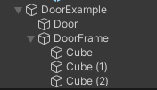
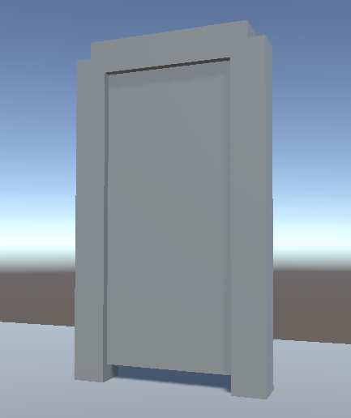
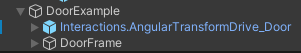
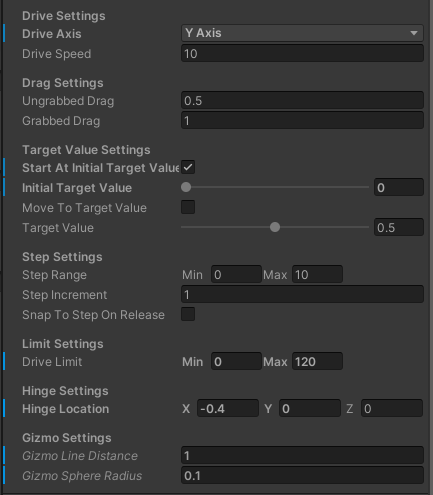

# Создание вращаемого объекта (Angular Drive)

> * Reading Time: 10 minutes
>
> * Checked with: Unity 2021.3.9f1

## Introduction

Данный гайд предназначен для создания вращаемого объекта на сцене. 
Данный объект возможно вращать вокруг оси.
Примеры: дверь, крышка сундука, руль.

## Let's Start

### Шаг 1

Для создания двери нам потребуется создать/загрузить модель самой двери. 
Чтобы дверь не висела в воздухе - также потребуется модель дверного проема.

Создайте пустой объект (`Main Menu -> GameObject -> Create Empty`) и переименуйте в `DoorExample`. 

### Шаг 2

В объекте `DoorExample` создайте `Cube` (`Main Menu -> GameObject -> 3D Object -> Cube`). 
Измените параметры компонента `Transform`:

  - Scale: `X = 0.8, Y = 1.8, Z = 0.1`
	
Переименуйте в `Door`.

### Шаг 3

В объекте `DoorExample` создайте пустой объект и переименуйте в `DoorFrame`.

В объекте `DoorFrame` разместите три `Cube` и измените им следующие параметры: 

Cube:

  - Position: `X = 0.5, Y = 1, Z = 0`
  - Scale: `X = 0.2, Y = 2, Z = 0.2`

Cube (1):

  - Position: `X = -0.5, Y = 1, Z = 0`
  - Scale: `X = 0.2, Y = 2, Z = 0.2`

Cube (2):

  - Position: `X = 0, Y = 2, Z = 0`
  - Scale: `X = 1, Y = 0.2, Z = 0.2`

Убедитесь в правильности структуры получившегося сложного объекта, сравнив с результатом на скриншоте:

### Шаг 3

Откройте `Window -> Tilia -> Interactions -> Controllable Creator`. 
Данный инструмент автоматически преобразует объект в один из видов контролируемых объектов, добавляя необходимые скрипты/объекты/компоненты.
Существует четыре типа:
	
  - `Linear Joint Drive` - Прямолинейное движение объекта от точки до точки. Использует физичеcкое взаимодействие Rigidbody.
  - `Linear Transform Drive` - Прямолинейное движение объекта от точки до точки. Kinematic.
  - `Angular Joint Drive` - Вращательное движение объекта вокруг оси. Использует физичеcкое взаимодействие Rigidbody.
  - `Angular Transform Drive` - Вращательное движение объекта вокруг оси. Kinematic.
	
Выберите тип `Angular Transform Drive`.

Выберите объект `Door` и нажмите на кнопку `Convert To Interactable`.

### Шаг 4

Измените параметры у компонента `Angular Drive Facade` объекта `Interactions.AngularTransformDrive_Door`

>  Параметры ниже изменяют поведение контролируемого объекта.
>  
>  * `Drive Axis` - Ось поворота объекта (`X`,`Y` или `Z`).
>  * `Drive Speed` - Скорость поворота. Чем выше, тем меньше движений рукой надо сделать, чтобы повернуть объект.
>  * `Ungrabbed Drag` - Трение при свободном движении.
>  * `Grabbed Drag` - Трение при движении с захватом рукой.
>  * `Start At Initial Target Value` - Начинать с определенного начального положения.
>  * `Initial Target Value` - Значения начального положения (0 и 1 - крайние положения).
>  * `Move To Target Value` - Двигать объект в определенное положение (работает только в режиме `Play`).
>  * `Target Value` - Определенное положение для предыдущего параметра.(работает только в режиме `Play`).
>  * `Step Range` - Разбивает на части весь путь движения объекта от мин до макс.
>  * `Step Increment` - Трение при движении с захватом рукой.
>  * `Snap To Step to Release` - При свободном движении не продолжает двигаться по инерции, а доходит до точек(`Step`), указанных в двух предыдущих параметрах.
>  * `Drive Limit` - Ограничение поворота объекта в градусах.
>  * `Hinge Location` - Координаты оси поворота относительно якоря объекта (`Attach Point`).
>  * `Gizmo Line Distance` - Ось поворота отображается линией в редакторе. Длина оси.
>  * `Gizmo Sphere Radius` - Размер сфер на концах оси.

## Готово

Нажмите на `Play`.
Переместите контроллер к двери так, чтобы ее коснуться. 
Зажмите `ЛКМ` (`Left_Trigger`), чтобы схватить объект левым контроллером, `ПКМ` (`Right_Trigger`) - правым. 
Не отпуская клавишу, отведите контроллер в сторону. Дверь открылась!

