# Создание вращаемого объекта (Angular Joint Drive, Рычаг)

> * Reading Time: 10 minutes
>
> * Checked with: Unity 2021.3.9f1

## Introduction

Данный гайд предназначен для создания вращаемого объекта на сцене. 
Данный объект возможно вращать вокруг оси.
Примеры: дверь, крышка сундука, руль.

## Let's Start

### Шаг 1

Для создания рычага (`Level`) нам потребуется создать/загрузить модель рычага. 
Чтобы рычаг не висел в воздухе - также потребуется модель основы рычага.

Создайте пустой объект (`Main Menu -> GameObject -> Create Empty`) и переименуйте в `LevelExample`. 

### Шаг 2

Потребуется создать сам рычаг и объект, который этот рычаг будет включать/выключать.

В объекте `LevelExample` создайте пустой объект (`ПКМ -> Create Empty`) и переименуйте в `Level`.
Все объекты внутри него будут являться частями рычага.

В объекте `LevelExample` создайте объект `Cube` (`ПКМ -> 3D Object -> Cube`) и переименуйте в `TestCube`.
Этот объект будет включаться/выключаться при помощи рычага.

  - Position: `X = 0, Y = 0, Z = 1.5`
 

### Шаг 3

В объекте `Level` создайте объект `Sphere` (`ПКМ -> 3D Object -> Sphere`) и переименуйте в `Base`. Это основа рычага.
Удалите компонент `Sphere Collider`. 

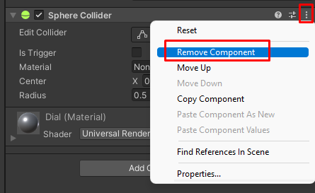

Измените параметры компонента `Transform`:

  - Scale: `X = 0.1, Y = 0.1, Z = 0.1`

В объекте `Level` создайте объект `Cube` и переименуйте в `Handle`. Это рукоятка рычага.
Измените параметры компонента `Transform`:

  - Position: `X = 0, Y = 0.1, Z = 0`
  - Scale: `X = 0.05, Y = 0.05, Z = 0.05`

Убедитесь в правильности структуры получившегося сложного объекта, сравнив с результатом на скриншоте:

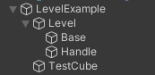

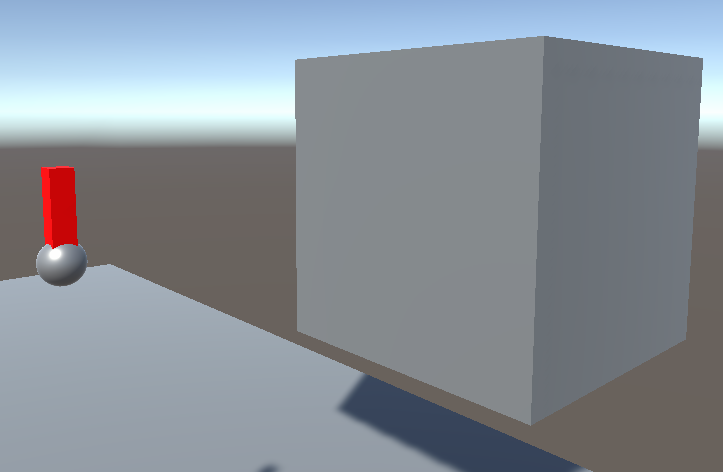

### Шаг 4

Откройте `Window -> Tilia -> Interactions -> Controllable Creator`. 

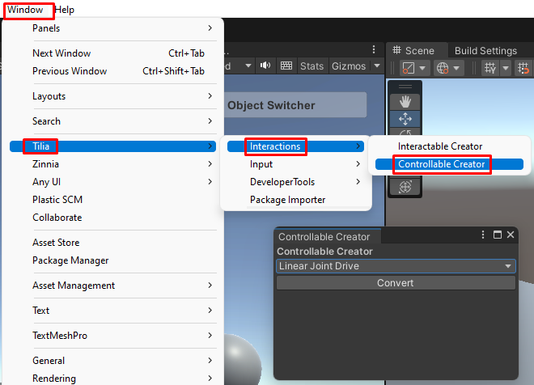

> Данный инструмент автоматически преобразует объект в один из видов контролируемых объектов, добавляя необходимые скрипты/объекты/компоненты.
> Существует четыре типа:
>	
>   - `Linear Joint Drive` - Прямолинейное движение объекта от точки до точки. Использует физичеcкое взаимодействие Rigidbody.
>   - `Linear Transform Drive` - Прямолинейное движение объекта от точки до точки. Kinematic.
>   - `Angular Joint Drive` - Вращательное движение объекта вокруг оси. Использует физичеcкое взаимодействие Rigidbody.
>   - `Angular Transform Drive` - Вращательное движение объекта вокруг оси. Kinematic.
	
Выберите тип `Angular Joint Drive`.

Выберите объект `Handle` и нажмите на кнопку `Convert`.

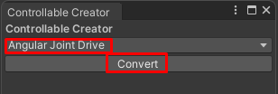

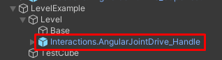

### Шаг 4

Измените параметры у компонента `Angular Drive Facade` объекта `Interactions.AngularJointDrive_Handle`

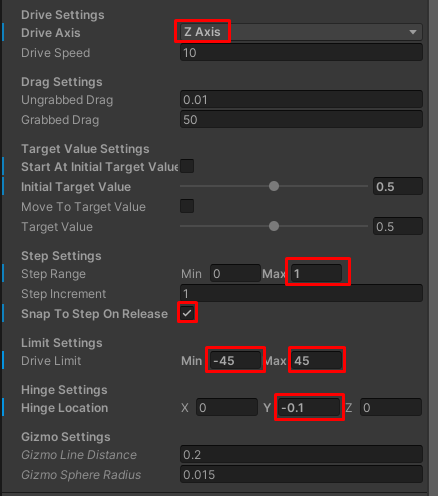

>  Параметры ниже изменяют поведение контролируемого объекта.
>  
>  * `Drive Axis` - Ось поворота объекта (`X`,`Y` или `Z`).
>  * `Drive Speed` - Скорость поворота. Чем выше, тем меньше движений рукой надо сделать, чтобы повернуть объект.
>  * `Ungrabbed Drag` - Трение при свободном движении.
>  * `Grabbed Drag` - Трение при движении с захватом рукой.
>  * `Start At Initial Target Value` - Начинать с определенного начального положения.
>  * `Initial Target Value` - Значения начального положения (0 и 1 - крайние положения).
>  * `Move To Target Value` - Двигать объект в определенное положение (работает только в режиме `Play`).
>  * `Target Value` - Определенное положение для предыдущего параметра.(работает только в режиме `Play`).
>  * `Step Range` - Разбивает на части весь путь движения объекта от мин до макс.
>  * `Step Increment` - Трение при движении с захватом рукой.
>  * `Snap To Step to Release` - При свободном движении не продолжает двигаться по инерции, а доходит до точек(`Step`), указанных в двух предыдущих параметрах.
>  * `Drive Limit` - Ограничение поворота объекта в градусах.
>  * `Hinge Location` - Координаты оси поворота относительно якоря объекта (`Attach Point`).
>  * `Gizmo Line Distance` - Ось поворота отображается линией в редакторе. Длина оси.
>  * `Gizmo Sphere Radius` - Размер сфер на концах оси.

### Шаг 5

Теперь необходимо настроить события (`Events`), которые срабатывают при размещении рычага в крайних положениях.
Для `AngularJointDrive` доступны (по умолчанию) три ослеживаемых действия (`Action`):

  - `Minimum Value Reached Action` - действие при достижении минимального положения.
  - `Middle Value Reached Action` - действие при достижении среднего положения.
  - `Mmaximum Value Reached Action` - действие при достижении максимального положения.

Выберите объект `AngularJointDrive_Handle`, в компоненте `AngularJointDrive` нажмите на кнопку `Show Minimum Value Reached Action`.
Выберите подсветившийся объект `MinimumReached`.

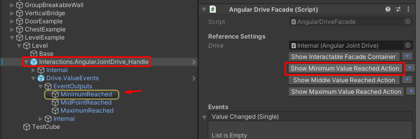

Раскройте событие `Activated (Boolean)` и нажмите на `+`. 
Сюда небходимо добавлять события, которые должны выполняться, по достижению рукоятки минимального положения.

Перенесите объект `TestCube` в поле None (Object). Выберите исполняющую функцию `GameObject -> SetActive(Bool)`. Флажок оставьте пустым ☐. 

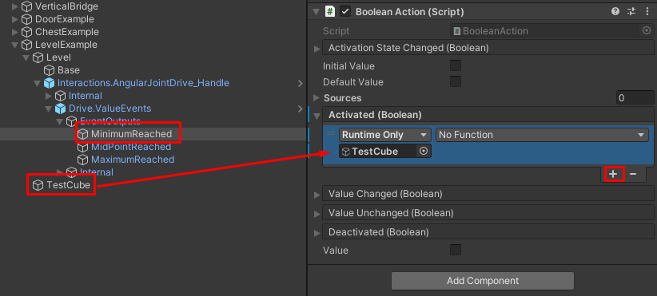

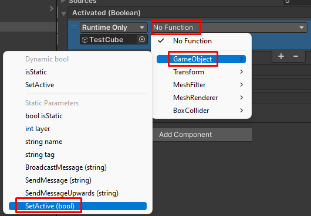

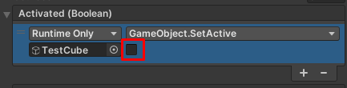

Повторите те же действия для `MaximumReached`, но поставьте флажок ☑.

## Готово

Нажмите на `Play`.
Переместите контроллер к рукоятке рычага так, чтобы ее коснуться. 
Зажмите `ЛКМ` (`Left_Trigger`), чтобы схватить объект левым контроллером или `ПКМ` (`Right_Trigger`) - правым. 
Не отпуская клавишу, отведите контроллер в сторону. Рычаг последовал за контроллером, и по достижении крайнего правого или левого положения `TestCube` то появляется, то исчезает.

