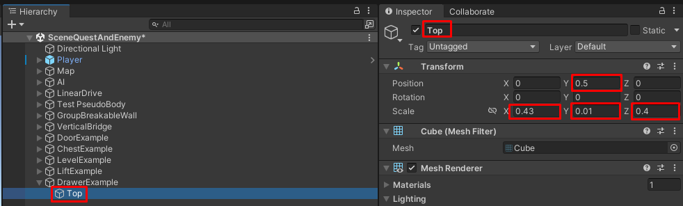
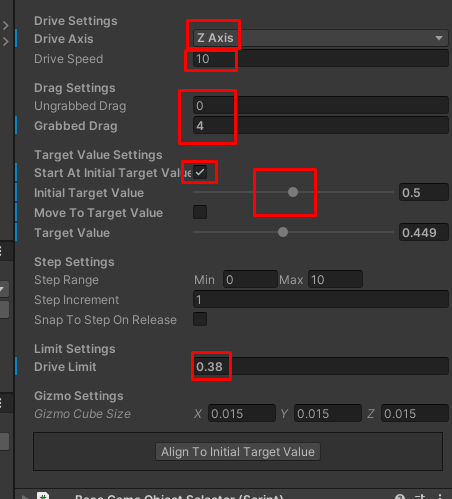
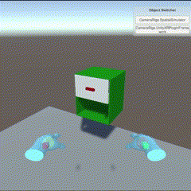

# Создание выдвижного ящика (Linear Joint Drive)

> * Reading Time: 10 minutes
>
> * Checked with: Unity 2018.3.14f1

## Introduction

Выдвижной ящик - это самый простой пример того, как используя Linear Drive создать скользящий по одной оси объект.

## Let's Start

### Шаг 1

Создайте пустой объект (`Main Menu -> GameObject -> Create Empty`) и переименуйте в `DrawerExample`.

### Step 2

В объекте `DrawerExample` создайте объект `Cube` (`ПКМ -> 3D Object -> Cube`). Измените параметры компонента `Transform`:

  - Position: `X = 0, Y = 0.5, Z = 0`
  - Scale: `X = 0.43, Y = 0.01, Z = 0.4`
  
Переименуйте в `Top`.

Create a new `Cube` Unity 3D Object by selecting `Main Menu -> GameObject -> 3D Object -> Cube` and make it a child of the `Cabinet` GameObject then change the Transform properties to:

* Position: `X = 0, Y = 0.5, Z = 0`
* Scale: `X = 0.43, Y = 0.01, Z = 0.4`

Rename the new `Cube` to `Top`.

> Поменяйте материал у объекта - будет проще различать в дальнейшем.
### Step 3

Создайте дочерние объекты у `DrawerExample` путем дублирования объекта `Top`.

У каждого получившегося объекта измените параметры компонента `Transform`:

#### Top (1)

* Position: `X = 0, Y = 0, Z = 0`
* Scale: X = `0.43, Y = 0.01, Z = 0.4`

Переименуйте `Top (1)` на `Bottom`.

#### Top (2)

* Position: `X = 0, Y = 0.25, Z = 0.195`
* Scale: `X = 0.43, Y = 0.5, Z = 0.01`

Переименуйте `Top (2)` на `Back`.

#### Top (3)

* Position: `X = 0.21, Y = 0.25, Z = 0`
* Scale: `X = 0.01, Y = 0.5, Z = 0.4`

Переименуйте `Top (3)` на `RightSide`.

#### Top (4)

  * Position: `X = -0.21, Y = 0.25, Z = 0`
  * Scale: `X = 0.01, Y = 0.5, Z = 0.4`

Переименуйте `Top (4)` на `LeftSide`.

### Step 4

Добавьте `Interactions.LinearJointDrive` в объект `DrawerExample` выбрав `GameObject -> Tilia -> Prefabs -> Interactions -> Controllables -> PhysicsJoint -> Interactions.LinearJointDrive`.

> The `Interactions.LinearJointDrive` prefab uses Unity joints and therefore works within the Unity physics system, however the `Interactions.LinearTransformDrive` is a linear drive that does not utilize joints or physics and can easily be swapped in place at this step if required.
### Step 5

Выберите `Interactions.LinearJointDrive` и измените параметры компонента `Transform`:

  * Position: `X = 0, Y = 0.375, Z = -0.2`

### Step 6

Пройдите к объекту `DrawerExample -> Interactions.LinearJointDrive -> Internal -> JointGameObject` и измените параметры компонента `Transform`:

* Position: `X = 0, Y = 0, Z = -0.2`
* Scale: `X = 0.4, Y = 0.25, Z = 0.01`

Переименуйте `Cube` на `DrawerFront`.

### Step 7

Создайте дочерние объекты у `MeshContainer` путем дублирования объекта `DrawerFront`.

У каждого получившегося объекта измените параметры компонента `Transform`:

#### DrawerFront (1)

* Position: `X = 0, Y = -0.12, Z = 0`
* Scale: `X = 0.4, Y = 0.01, Z = 0.4`

Переименуйте `DrawerFront (1)` на `DrawerBase`.

#### DrawerFront (2)

* Position: `X = 0.195, Y = -0.075, Z = 0`
* Scale: `X = 0.01, Y = 0.1, Z = 0.4`

Переименуйте `DrawerFront (2)` на `DrawerRight`.

#### DrawerFront (3)

* Position: `X = -0.195, Y = -0.075, Z = 0`
* Scale: `X = 0.01, Y = 0.1, Z = 0.4`

Переименуйте `DrawerFront (3)` на `DrawerLeft`.

#### DrawerFront (4)

* Position: `X = 0, Y = -0.075, Z = 0.195`
* Scale: `X = 0.4, Y = 0.1, Z = 0.01`

Переименуйте `DrawerFront (4)` на `DrawerBack`.

#### DrawerFront (5)

* Position: `X = 0, Y = 0, Z = -0.215`
* Scale: `X = 0.1, Y = 0.025, Z = 0.025`

Переименуйте `DrawerFront (5)` на `DrawerHandle`.

### Step 8

Выберите `DrawerExample -> Interactions.LinearJointDrive` и измените параметры компонента `Linear Drive Facade`:

* Drive Axis: `Z Axis`
* Start At Initial Target Value: `checked`
* Initial Target Value: `1`
* Drive Limit: `0.4`

Нажмите `Align to initial target value` для размещения ящика в стартовую позицию.

### Done

Нажмите на `Play`.
Переместите контроллер к рукоятке рычага так, чтобы ее коснуться. 
Зажмите `ЛКМ` (`Left_Trigger`), чтобы схватить объект левым контроллером или `ПКМ` (`Right_Trigger`) - правым. 
Не отпуская клавишу, отведите контроллер в сторону. выдвижной ящик выдвинулся до упора (крайнего положения)

