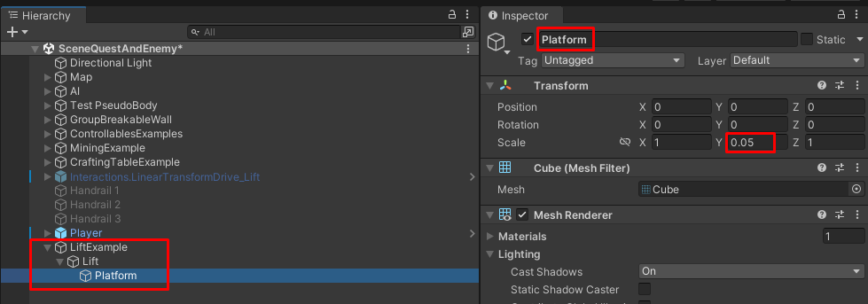
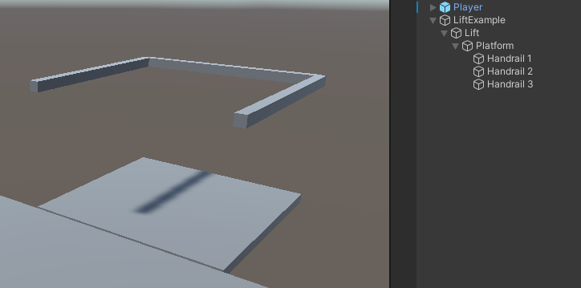
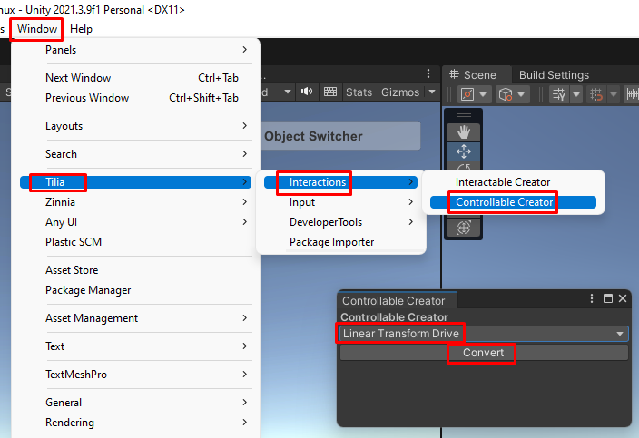
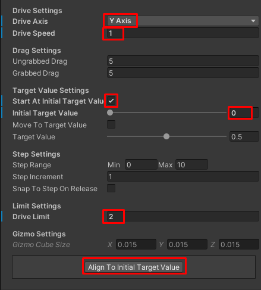
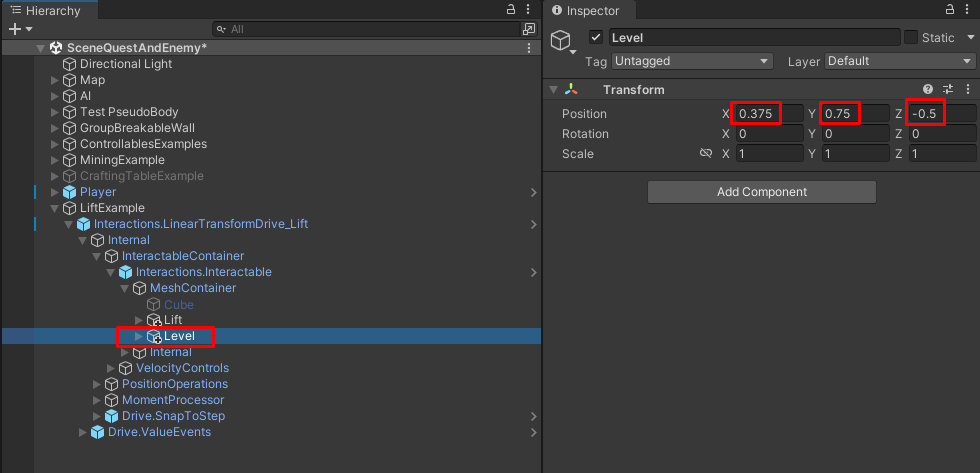
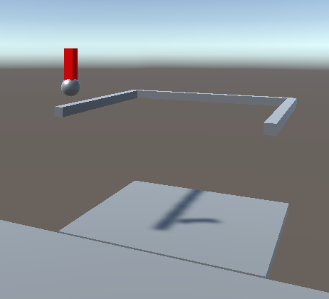
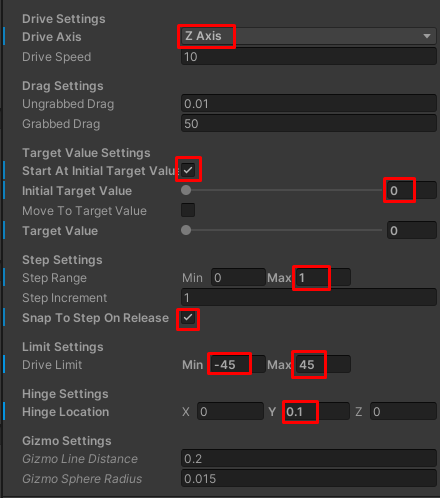
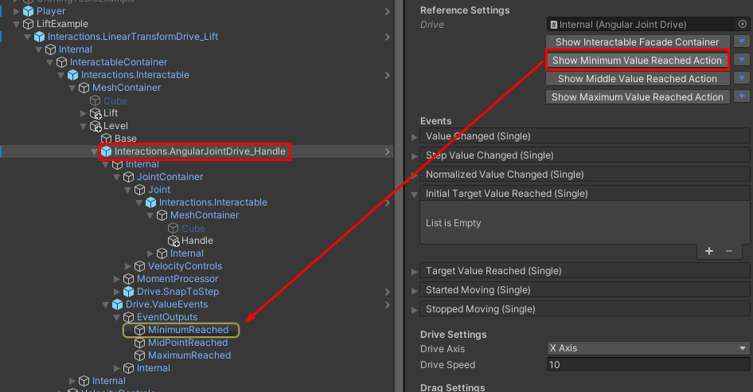
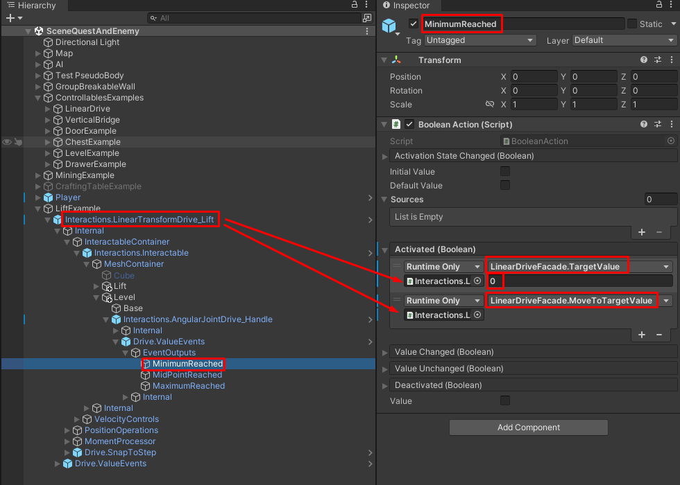
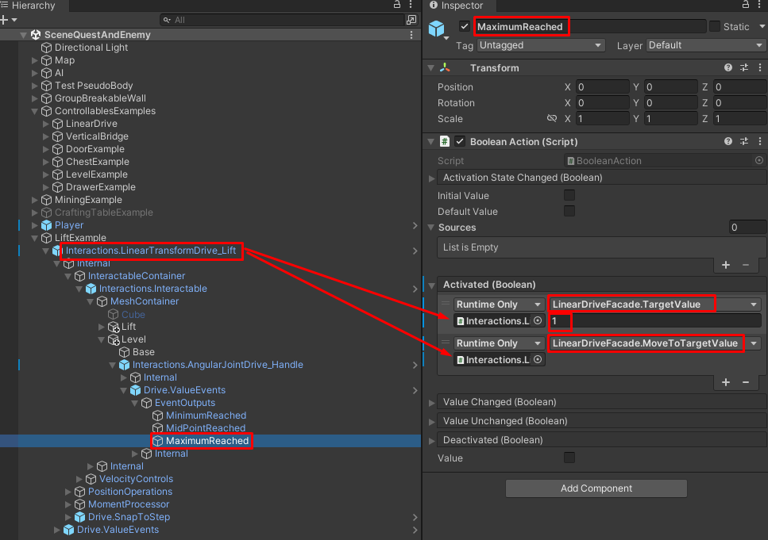

# Создание лифта (Linear Transform Drive)

> * Reading Time: 10 minutes
>
> * Checked with: Unity 2018.3.14f1

## Introduction

Самый простой лифт - это платформа, которая двигается вдоль вертикальной оси, перемещая предметы или игрока.
В отличие от `Linear Joint Drive`, `Linear Transform Drive` игнорирует физические столкновения с другими интерактивными предметами, поэтому сдвинуть лифт другим предметом не получится (что нам и нужно).

## Let's Start

### Шаг 1

Создайте пустой объект (`Main Menu -> GameObject -> Create Empty`) и переименуйте в `LiftExample`.

### Шаг 2

В объекте `LiftExample` создайте пустой объект (`ПКМ -> Create Empty`) и переименуйте в `Lift`.
Все объекты внутри него будут являться частями лифта (платформа и поручни).

В объекте `Lift` создайте объект `Cube` (`ПКМ -> 3D Object -> Cube`). Измените параметры компонента `Transform`:

  - Position: `X = 0, Y = 0, Z = 0`
  - Scale: `X = 1, Y = 0.05, Z = 1`
  
Переименуйте в `Platform`.

### Шаг 3

Создайте дочерние объекты у `Lift` путем дублирования объекта `Platform`.

У каждого получившегося объекта измените параметры компонента `Transform`:

#### Platform (1)

* Position: `X = -0.5, Y = 0.635, Z = 0`
* Scale: X = `0.05, Y = 0.05, Z = 1`

Переименуйте `Platform (1)` на `Handrail 1`.

#### Platform (2)

* Position: `X = 0, Y = 0.635, Z = -0.5`
* Scale: `X = 1, Y = 0.05, Z = 0.05`

Переименуйте `Platform (2)` на `Handrail 2`.

#### Platform (3)

* Position: `X = 0, Y = 0.635, Z = 0.5`
* Scale: `X = 1, Y = 0.05, Z = 0.05`

Переименуйте `Platform (3)` на `Handrail 3`.

### Шаг 4

Откройте `Window -> Tilia -> Interactions -> Controllable Creator`. 

> Данный инструмент автоматически преобразует объект в один из видов контролируемых объектов, добавляя необходимые скрипты/объекты/компоненты.
> Существует четыре типа:
>	
>   - `Linear Joint Drive` - Прямолинейное движение объекта от точки до точки. Использует физичеcкое взаимодействие Rigidbody.
>   - `Linear Transform Drive` - Прямолинейное движение объекта от точки до точки. Kinematic.
>   - `Angular Joint Drive` - Вращательное движение объекта вокруг оси. Использует физичеcкое взаимодействие Rigidbody.
>   - `Angular Transform Drive` - Вращательное движение объекта вокруг оси. Kinematic.
	
Выберите тип `Linear Transform Drive`.

Выберите объект `Lift` и нажмите на кнопку `Convert`.

Добавьте `Interactions.LinearTransformDrive` в объект `DrawerExample` выбрав `GameObject -> Tilia -> Prefabs -> Interactions -> Controllables -> PhysicsJoint -> Interactions.LinearJointDrive`.

### Шаг 5

Измените параметры у компонента `Linear Transform Drive` объекта `Interactions.LinearTransformDrive_Lift`

>  Параметры ниже изменяют поведение контролируемого объекта.
>  
>  * `Drive Axis` - Ось поворота объекта (`X`,`Y` или `Z`).
>  * `Drive Speed` - Скорость поворота. Чем выше, тем меньше движений рукой надо сделать, чтобы повернуть объект.
>  * `Ungrabbed Drag` - Трение при свободном движении.
>  * `Grabbed Drag` - Трение при движении с захватом рукой.
>  * `Start At Initial Target Value` - Начинать с определенного начального положения.
>  * `Initial Target Value` - Значения начального положения (0 и 1 - крайние положения).
>  * `Move To Target Value` - Двигать объект в определенное положение (работает только в режиме `Play`).
>  * `Target Value` - Определенное положение для предыдущего параметра.(работает только в режиме `Play`).
>  * `Step Range` - Разбивает на части весь путь движения объекта от мин до макс.
>  * `Step Increment` - Трение при движении с захватом рукой.
>  * `Snap To Step to Release` - При свободном движении не продолжает двигаться по инерции, а доходит до точек(`Step`), указанных в двух предыдущих параметрах.
>  * `Drive Limit` - Ограничение поворота объекта в градусах.
>  * `Hinge Location` - Координаты оси поворота относительно якоря объекта (`Attach Point`).
>  * `Gizmo Line Distance` - Ось поворота отображается линией в редакторе. Длина оси.
>  * `Gizmo Sphere Radius` - Размер сфер на концах оси.

### Шаг 6

Чтобы управлять лифтом потребуется рычаг (Level).
Как сделать рычаг можно посмотреть в инструкции [Создание вращаемого объекта (Angular Joint Drive, Рычаг)](/Guides/04_AngularJointDrive_Level/)

Поместите рычаг в `LiftExample -> Interactions.LinearTransformDrive_Lift -> Internal -> InteractableContainer -> Interactions.Interactable -> MeshContainer` на одном уровне с `Lift`

Измените параметры компонента `Transform` объекта `Level`:

  - Position: `X = 0.375, Y = 0.75, Z = -0.5`

### Шаг 7

Найдите дочерний объект `Interactions.AngularJointDrive_Handle` у объекта `Level` и измените параметры компонента `Angular Joint Drive`

### Шаг 8

Теперь необходимо настроить события (`Events`), которые срабатывают при размещении рычага в крайних положениях.
Для `AngularJointDrive` доступны (по умолчанию) три ослеживаемых действия (`Action`):

  - `Minimum Value Reached Action` - действие при достижении минимального положения.
  - `Middle Value Reached Action` - действие при достижении среднего положения.
  - `Mmaximum Value Reached Action` - действие при достижении максимального положения.

Выберите объект `AngularJointDrive_Handle`, в компоненте `AngularJointDrive` нажмите на кнопку `Show Minimum Value Reached Action`.
Выберите подсветившийся объект `MinimumReached`.

Раскройте событие `Activated (Boolean)` и нажмите на `+`. 

> Сюда небходимо добавлять события, которые должны выполняться, по достижению рукоятки минимального положения.

Перенесите объект `Interactions.LinearTransformDrive_Lift` в поле None (Object). 
Выберите исполняющую функцию `LinearDriveFacade -> float TargetValue`. 
Введите значение `0`. 

Нажмите еще раз на `+`. 
Перенесите объект `Interactions.LinearTransformDrive_Lift` в поле None (Object). 
Выберите исполняющую функцию `LinearDriveFacade -> MoveToTargetValue`. 

Повторите те же действия для `MaximumReached`, но в `TargetValue` поставьте `1`.

### Готово

Нажмите на `Play`.
Переместите контроллер к рукоятке рычага так, чтобы ее коснуться. 
Зажмите `ЛКМ` (`Left_Trigger`), чтобы схватить объект левым контроллером или `ПКМ` (`Right_Trigger`) - правым. 
Не отпуская клавишу, отведите контроллер в сторону. Лифт начнет движение

