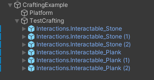

# Создание крафта инструмента (Interactablе, SnapZone, AnyTagRule)

> * Reading Time: 10 minutes
>
> * Checked with: Unity 2018.3.14f1

## Introduction

Самый простой пример механики крафта: палка + камень = топор. К `SnapZone` интерактивной палки подносится интерактивный камень, и палка превращается в интерактивный топор. 

## Let's Start

### Шаг 1

Создайте пустой объект (`Main Menu -> GameObject -> Create Empty`) и переименуйте в `CraftingExample`.

### Шаг 2

Для примера понадобится стол (Platform) и несколько интерактивных объектов (палка, камень).

В объекте `CraftingExample` создайте `Cube` (`Main Menu -> GameObject -> 3D Object -> Cube`).

Переименуйте этот объект в `Platform` и разместите на некотором растоянии от земли.

Создайте несколько интерактивных объектов `Stone` и `Plank`. 
Как создать интерактивный объект можно узнать в гайде [Создание интерактивного объекта (Interactable)](/Guides/01_Interactive/).

### Шаг 3

Для уменьшение зоны активации захвата предметов измените параметр `Size` на `0.3` у компонента `Sphere Collider` у объекта `Interactions.Snapzone -> ActivationCollisionArea`.

### Шаг 4

Пройдите к объекту `Interactions.Snapzone -> SnapDestination -> DestinationHighlight -> HighlightMeshContainer -> DefaultHighlightMesh` и отключите его.
Вместо него создайте в том же родительском объекте `HighlightMeshContainer` сферу (`ПКМ -> 3D -> Sphere`) и измените параметры у компонента `Transform`:

	- Scale: `X = 0.6, Y = 0.6, Z = 0.6`

Отключите или удалите компонент `Sphere Collider`.

Измените материал сферы на любой прозрачный материал (скачанный/созданный)

### Шаг 5

Для изменения положения/вращения/размера предмета при примагничивании к слоту необходимо задать параметры у объекта `DestinationLocation`.
Пройдите к объекту `Interactions.Snapzone -> SnapDestination -> DestinationLocation` и измените параметры у компонента `Transform`:

	- Position: `X = -0.15, Y = 0.3, Z = 0`
	
	- Rotation: `X = 180, Y = 90, Z = 0`

### Шаг 6

Чтобы проверить как работает SnapZone потребуется интерактивный объект (Sword).
Как сделать интерактивный объект можно посмотреть в инструкции [Создание интерактивного объекта (Interactable)](/Guides/01_Interactive/)

Также понадобится стойка (основа), чтобы `SnapZone` не висел в воздухе (а это выглядит странно).

### Шаг 7

Настроим компонент `Snap Zone Facade` так, чтобы предмет перемещался к слоту в течение одной секунды и чтобы при запуске сцены меч уже находился в слоте:

`Transition Duration` установите на `1`

Перетащите интерактивный объект `Sword` в параметр `Initial Snapped Interactable`.

>  Параметры ниже изменяют поведение `SnapZone`.
>  
>  * `Snap Validity` - Правило (Rule) согласно которому происходит примагничивание объекта к слоту.
>  * `Transition Duratioт` - Скорость перехода объекта с момента попадания в зону активации до прикрепленного состояния(`Snapped`).
>  * `Initial Snapped Interactable` - При запуске сцены указанный предмет будет изначально прикреплен к слоту.
>  * `Auto Snap Trown Objects` - При включенном состоянии слот может "ловить" любые проходяшие зону активации интерактивные объекты, а не только те, что помещаются рукой.
>  * `Zone Events` - Параметры срабатываемых событий (Events).

## Готово

Нажмите на `Play`.
Переместите контроллер к мечу так, чтобы его коснуться. 
Зажмите `ЛКМ` (`Left_Trigger`), чтобы схватить объект левым контроллером или `ПКМ` (`Right_Trigger`) - правым. 
Не отпуская клавишу, отведите контроллер в сторону. Полупрозрачная сфера исчезнет, как только меч покинет зону, и появится снова, как только меч зайдет в зону.
Если отпустить клавишу, то меч прикрепится к слоту в течении 1 сек.

