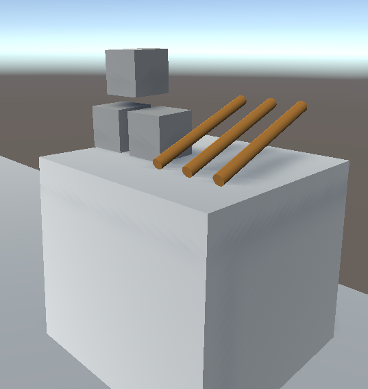
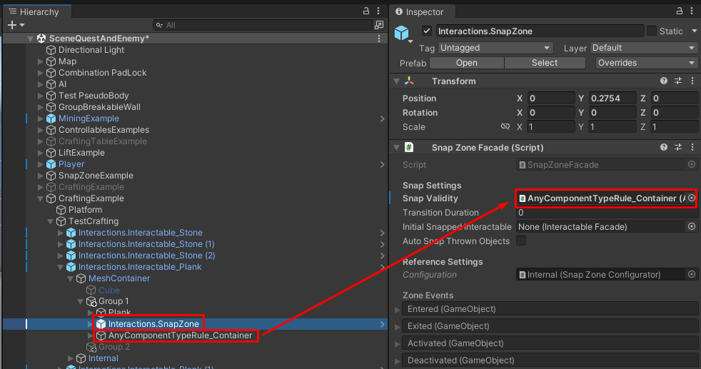
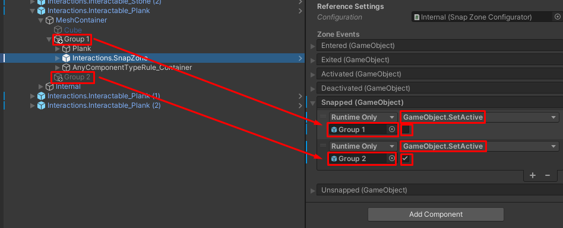
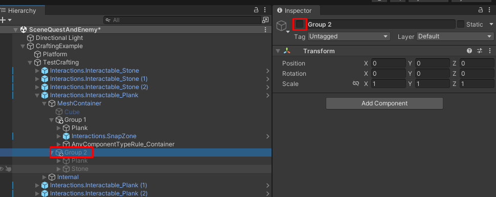
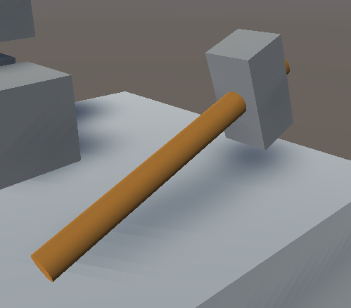

# Создание крафта инструмента (Interactablе, SnapZone, AnyTagRule)

> * Reading Time: 10 minutes
>
> * Checked with: Unity 2018.3.14f1

## Introduction

Самый простой пример механики крафта: палка + камень = топор. К `SnapZone` интерактивной палки подносится интерактивный камень, и палка превращается в интерактивный топор. 

## Let's Start

### Шаг 1

Создайте пустой объект (`Main Menu -> GameObject -> Create Empty`) и переименуйте в `CraftingExample`.

### Шаг 2

Для примера понадобится стол (Platform) и несколько интерактивных объектов (палка, камень).

В объекте `CraftingExample` создайте `Cube` (`ПКМ -> GameObject -> 3D Object -> Cube`).

Переименуйте этот объект в `Platform` и разместите на некотором растоянии от земли.

Создайте несколько интерактивных объектов `Stone` и `Plank` и объедините их в родительский объект `TestCrafting`. 
Как создать интерактивный объект можно узнать в гайде [Создание интерактивного объекта (Interactable)](/Guides/01_Interactive/).




### Шаг 3

В объекте `Interactions.Interactable_Plank -> MeshContainer` создайте два пустых контейнера `Group 1` и `Group 2`. 
Поместите все составляющие палку объекты в `Group 1`. 


### Шаг 4

Создайте `SnapZone` у объекта `Interactions.Interactable_Plank`. Ее необходимо разместить в объекте `Group 1`. 
Как создать слот (`SnapZone`) можно узнать в гайде [Создание слота (Snap Zone)](/Guides/07_SnapZone/).

<details><summary> :green_circle: Дополнительно :green_circle: </summary><p>

Для уменьшение зоны активации захвата предметов измените параметр `Size` на `0.1` у компонента `Sphere Collider` у объекта `Interactions.Snapzone -> ActivationCollisionArea`.

Пройдите к объекту `Interactions.Snapzone -> SnapDestination -> DestinationHighlight -> HighlightMeshContainer -> DefaultHighlightMesh` и отключите его.
Вместо него создайте в том же родительском объекте `HighlightMeshContainer` сферу (`ПКМ -> 3D -> Sphere`) и измените параметры у компонента `Transform`:

	- Scale: `X = 0.1, Y = 0.1, Z = 0.1`

Отключите или удалите компонент `Sphere Collider`.

Измените материал сферы на любой прозрачный материал (скачанный/созданный).

</p></details>


### Шаг 5

Для того чтобы к палке прикреплялись только лишь камни, необходимо создать правило (`Rule`), которому будет слодовать `SnapZone`.
Правило будет таким - прикрепляться к слоту будут все объекты с компонентом `Tag_Item_Stone`.

Компонентом `Tag_Item_Stone` будет являться пустой пользовательский скрипт. 
В папке `Scripts -> Tags` (при отсутствии создайте эти папки) создайте скрипт с названием `Tag_Item_Stone` (`ПКМ -> Create -> C# Script`).
Откройте скрипт и удалите лишние функции и строки. В итоге скрипт должен выглядеть так:

```
using UnityEngine;
public class Tag_Item_Stone : MonoBehaviour {}
```

Перетащите получившийся скрипт `Tag_Item_Stone` на объект камня (`Interactions.Interactable_Stone`).


### Шаг 6

Теперь необходимо создать правило. Выберите объект `Group 1` - он будет содержать правило для слота.

Нажмите на `Window -> Zinnia -> Observable List Component Generator` и в появившемся окне измените параметр `Component Type` на `Any Component Type Rule` (правило "Любой объект с определенным типом компонента")
Проверьте название параметра `Generate in` содержит `[Group 1]` и нажмите на кнопку `Generate Component`.

Выберите созданный объект `AnyComponentTypeRule_Container` и в инспекторе у параметра компонента `AnyComponentTypeRule` добавьте новый элемент (`+`). Выберите `Tag_Item_Stone`.


### Шаг 7

Выберите объект `Interactions.SnapZone` и перетащите объект `AnyComponentTypeRule_Container` в параметр `Snap Validity` компонента `Snap Zone Facade`.

Создайте две функции переключения групп объектов в событии `Snapped` (`+`). Перетащите объекты `Group 1` и `Group 2` в появившиеся параметры и выберите функции `GameObject.SetActive` (деактивируйте у 1 и активируйте у 2 соответственно)

Выключите объект `Group 2` предварительно поместив в него модель инструмента или созданные модели топора










## Готово

Нажмите на `Play`.
Переместите контроллер к палке так, чтобы ее коснуться. 
Зажмите `ЛКМ` (`Left_Trigger`), чтобы схватить объект левым контроллером или `ПКМ` (`Right_Trigger`) - правым. 
Не отпуская клавишу, захватите камень другой рукой. Поднесите камень к палке (туда где `SnapZone`) и отпустите камень - палка превратится в топор.


