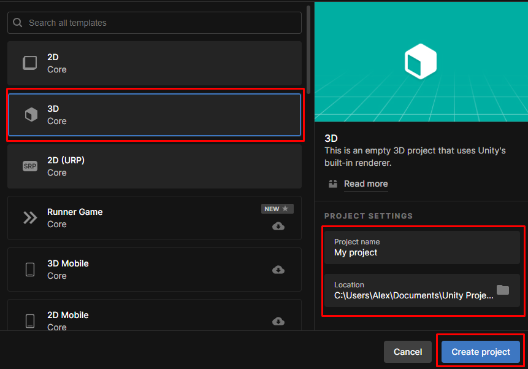

# VR Player Package (Установка)

## Introduction
EMPTY

## Let's Start

### Шаг 1

Создайте новый проект в Unity. Используйте шаблон `3D Core`.

### Шаг 2

Импортируйте в проект `VR Player Package`. 

### Шаг 3

Открыть настройки проекта `Edit -> Project Settings`. Перейти на `XR Plugin Management`. Установить плагин, нажав на кнопку `Install XR Plugin Management`. Поставить флажок напротив `Open XR`.

Появляется окно с предложением перейти на новую систему Input ('NO'). Чтобы исправить ошибку, необходимо перейти в раздел `Player` и изменить параметр `Active Input Handling` на `Both` (новая система нужна для работы со шлемом, а старая для симуляции с клавиатуры). Принять презагрузку `Editor`.

После перезагрузки пройти `Edit -> Project Settings -> XR Plugin Management -> Open XR` и создать новый профайл взаимодействия, выбрав в `Interaction Profiles` `Oculus Touch Controller Profile` и/или `HTC Vive Controller Profile`

### Шаг 4

Скачайте и импортируйте из Asset Store пакет `VRTK v4 Tilia Package Importer`. [ссылка]
В диалоговом окне нажать `Install/Upgrade`.

[-Устарело!-]

Please refer to the [installation] guide to install this package.
Скачать .NET 4.x https://www.microsoft.com/ru-RU/download/details.aspx?id=17718

### Шаг 5

Откройте `Windows -> Tilia -> Package Importer` и нажмите на кнопку `Add Scoped Registry`. Поставьте флажки напротив следующих пакетов:

* `Tilia.CameraRigs.SpatialSimulator.Unity`
* `Tilia.CameraRigs.TrackedAlias.Unity`
* `Tilia.CameraRigs.XRPluginFramework.Unity`
* `Tilia.Input.UnityInputSystem`
* `Tilia.Interactions.Controllables.Unity`
* `Tilia.Interactions.Interactables.Unity`
* `Tilia.Interactions.SnapZone.Unity`
* `Tilia.Locomotors.AxisMove.Unity`
* `Tilia.Mutators.CollisionIgnorer.Unity`
* `Tilia.Trackers.ColliderFollower.Unity`
* `Tilia.Trackers.PseudoBody.Unity`
* `Tilia.Utilities.ObjectStateSwitcher.Unity`
* `Tilia.Visuals.CollisionFader.Unity`
* `Tilia.Visuals.Tooltip.Unity`

Нажмите на кнопку `Add Selected Packages`.

В окне `Manage Unity InputManager Axis Definition` нажмите на кнопку `Add Input Definitions`.

## Готово

Нажмите на `Play`. В правом верхем углу окна `Game` появится интерфейс с кнопками `CameraRigs.SpatialSimulator` для запуска симуляции и `CameraRigs.UnityXRPluginFramework` для запуска на подключенном к ПК VR-шлеме. 

Если перед этим вы установаили и настроили приложение `Oculus` для шлема `Oculus Quest 2` или `Steam VR` для шлема `HTC Vive`, то все запустится без проблем.

[Installation]: https://github.com/ExtendRealityLtd/Tilia.Indicators.ObjectPointers.Unity/blob/master/Documentation/HowToGuides/Installation/README.md
[ссылка]: https://assetstore.unity.com/packages/tools/utilities/vrtk-v4-tilia-package-importer-214936
