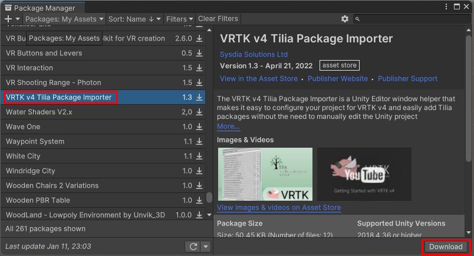

# VR Player Package (Установка)

> * Reading Time: 10 minutes
>
> * Checked with: Unity 2021.3.9f1

## Introduction

VR Player Package основан на тулките VRTK v4.

Данный гайд посвящен быстрой настройке проекта для запуска на VR-шлеме (Oculus Quest 1/2 или HTC Vive).

VRPP содержит уже настроенный префаб игрока с 3D-симуляцией, плавным передвижением и системой захватом предметов.


## Let's Start

### Шаг 1

Создайте новый проект в Unity. Используйте шаблон `3D Core`.


Создайте новый примитивный объект `Cube` выбрав `Main Menu -> GameObject -> 3D Object -> Cube` и измените параметры компонента `Transform`:

> * Position: `X = 0, Y = -0.5, Z = 0`
> * Scale: `X = 3, Y = 1, Z = 3`

Переименуйте `Cube`	`rgb(9, 105, 218)`на `Floor`.


### Шаг 2

Скачайте и импортируйте в проект пакет `VR Player Package`. 

---> [VRPlayerPackage] <---


Переместите на сцену префаб `Player`


### Шаг 3

Открыть настройки проекта `Edit -> Project Settings`. Перейти на `XR Plugin Management`. Установить плагин, нажав на кнопку `Install XR Plugin Management`. Поставить флажок напротив `Open XR`.

 


Появляется окно с предложением перейти на новую систему Input, выберите `NO`, после чего в консоли отобразится ошибка. Чтобы исправить ошибку, необходимо перейти в раздел `Player` и изменить параметр `Active Input Handling` на `Both` (новая система нужна для работы со шлемом, а старая для симуляции с клавиатуры). Принять презагрузку `Editor`.


После перезагрузки пройти `Edit -> Project Settings -> XR Plugin Management -> Open XR` и создать новый профайл взаимодействия, выбрав в `Interaction Profiles` `Oculus Touch Controller Profile` и/или `HTC Vive Controller Profile`


### Шаг 4

Скачайте и импортируйте из Asset Store пакет `VRTK v4 Tilia Package Importer`. 

---> [ссылка] <---




В диалоговом окне нажать `Install/Upgrade`.


<details>
<summary>```diff - [Устарело!] ```</summary>

Please refer to the [installation] guide to install this package.
Скачать .NET 4.x https://www.microsoft.com/ru-RU/download/details.aspx?id=17718

</details>

### Шаг 5

Откройте `Windows -> Tilia -> Package Importer` и нажмите на кнопку `Add Scoped Registry`. 


Поставьте флажки напротив следующих пакетов:

* `Tilia.CameraRigs.SpatialSimulator.Unity`
* `Tilia.CameraRigs.TrackedAlias.Unity`
* `Tilia.CameraRigs.XRPluginFramework.Unity`
* `Tilia.Input.UnityInputSystem`
* `Tilia.Interactions.Controllables.Unity`
* `Tilia.Interactions.Interactables.Unity`
* `Tilia.Interactions.SnapZone.Unity`
* `Tilia.Locomotors.AxisMove.Unity`
* `Tilia.Mutators.CollisionIgnorer.Unity`
* `Tilia.Trackers.ColliderFollower.Unity`
* `Tilia.Trackers.PseudoBody.Unity`
* `Tilia.Utilities.ObjectStateSwitcher.Unity`
* `Tilia.Visuals.CollisionFader.Unity`
* `Tilia.Visuals.Tooltip.Unity`

Нажмите на кнопку `Add Selected Packages`.


В окне `Manage Unity InputManager Axis Definition` нажмите на кнопку `Add Input Definitions`.


## Готово

Нажмите на `Play`. В правом верхем углу окна `Game` появится интерфейс с кнопками `CameraRigs.SpatialSimulator` для запуска симуляции и `CameraRigs.UnityXRPluginFramework` для запуска на подключенном к ПК VR-шлеме. 
	
> Если перед этим вы установили и настроили приложение `Oculus` для шлема `Oculus Quest 2` или `Steam VR` для шлема `HTC Vive`, то все запустится без проблем.
	

	
[Installation]: https://github.com/ExtendRealityLtd/Tilia.Indicators.ObjectPointers.Unity/blob/master/Documentation/HowToGuides/Installation/README.md
[ссылка]: https://assetstore.unity.com/packages/tools/utilities/vrtk-v4-tilia-package-importer-214936
[VRPlayerPackage]: assets/VRPlayerPackagePrefab/


